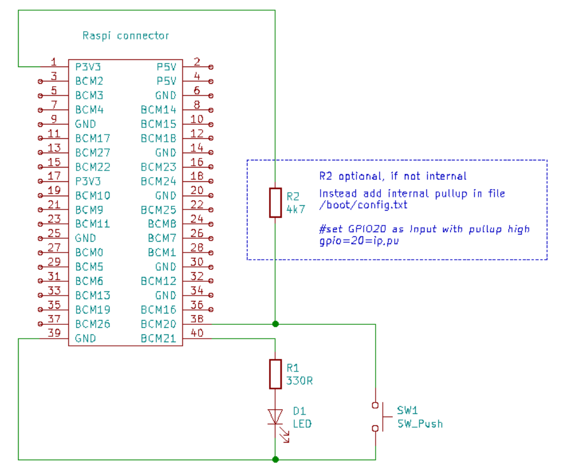

# Project 'Raspberry s_shut'

The  [s_shut](https://github.com/ECOM-Klaus/Raspberry-Shutdown) project describes a very simple system in order to shut down Raspberry Pi safely. It consists of a Python 3.x script *s_shut.py*, a simple schematic and this description.
 This project is tested in Raspberry models 3, 3B, 4B, zero-wh under raspbian V10 and above.
 The python script uses the awesome [libgpio](https://git.kernel.org/pub/scm/libs/libgpiod/libgpiod.git/about/) library,

## Background

Running Linux computer should not be powered off without a controlled shutdown by the operating system, because this can result in damaging the file system on the SD_Card. Raspberry computers do not provide a reset or power down switch.
 Controlled power down is especially critical important in so called headless systems with no monitor and keyboard.
 The presented solution allows initiating shutdown or a restart with a switch or an external signal.   
 The Project consists of a single Python 3.x script that may be started from command line or may be launched as auto-start process.

## Functionality

#### Raspberry power up LED

After Linux boot, a selectable port (default BCM21) is driven high and LED goes ON

#### Shutdown: switch pressed > 2 seconds

A switch on a selectable port (default BCM20) triggers events used in the script s_shut.py.
 Linux command `shutdown -P now` will be executed by the script s_shut.py . As soon as critical storage operations are completed, LED goes OFF.

#### Restart: switch double clicked

System shuts down and restarts.
Linux command `shutdown -r now`  will be executed by the script s_shut.py.

#### Shutdown + power off: switch pressed > 5 seconds

(Power off needs external hardware)

#### Restart after shut down

This is only achievable by external power off and on again. (A much more convenient solution is using the "UPS-2" project, that will follow here in the first Quarter 2021)

## Quick Install Summary

This summary is intended for experienced users.

1. Prepare hardware, see [Fig. 1](#Fig. 1)
2. Download script s_shut.py   
    `wget https://raw.githubusercontent.com/ECOM-Klaus/Raspberry-Shutdown/master/s_shut.py`  
3. Install libgpiod library  
    `sudo apt install python3-libgpiod`
4. Activate pullup resistor in file /boot/config.txt   
    `#set GPIO20 as input with pullup high`  
    `gpio=20=ip,pu`  
5. Autostart s_shut.py script in file /etc/rc.local  
    `python3 /home/pi/<*your project location*>/s_shut.py &`
    	

## Software Installation

1. Download 'Raspberry Imager' and follow instructions for creating SD card:  
    https://www.raspberrypi.org/software/  
    This project works with all OS versions.
    	

2. Edit file config.txt:  
    The used [gpiod](https://github.com/warthog618/gpiod) library has no pullup feature. (will possibly come with Linux kernel >=V5.1). We have to set pullup in file config.txt. 
    This SD card file is visible on the PC or MAC directly in the root, or on Raspberry in the /boot directory (use sudo <editor>).  

   `#set GPIO20 as input with pullup high`  
   `gpio=20=ip,pu`
       

3. Install required library on Raspberry:  
    `sudo apt install python3-libgpiod`

4. Download shutdown script or clone project
    Change to your project directory and download the Python3 project script  
    `wget https://raw.githubusercontent.com/ECOM-Klaus/Raspberry-Shutdown/master/s_shut.py`  

   OR execute from your project directory   
    `git clone https://github.com/ECOM-Klaus/Raspberry-Shutdown.git`

5. Basic test  without hardware
    Change to your project directory and execute   
    `~ $ cd <your project directory>`

   Execute script help  
   `~ /<your project directory> $ python3 s_shut.py -h` 

 --> expected reponse:  
   `usage: s_shut.py [-h] [-l] [-s] [-p]`

​	 `optional arguments:`  
  `-h, --help          show this help message and exit`  
  `-l , --ledPort      LED output bcm port default = 21`  
  `-s , --switchPort   Switch control input bcm port default = 20`  
  `-p , --powerPort    Optional bcm port for external power time`r  

##    

## Hardware Installation

Required material: (example types)
- Metalfilm resistor 	330R, 1/4W
- [Metalfilm resistor 	4k7, 1/4W, optional, see [Software Installation|](#3.1.Software Installation|outline)]
- Tactile Switch 		Tyco FSM8J
- Green LED 3mm 	Kingbright L-7104SGC

   **Fig. 1**: Wiring Diagram with default ports.

## Test

Please test first with default ports. You may change it later by command line parameters. We test first by command line, later by autostart.

1. Raspi power on  
2. Wait until boot finished
3. Start a terminal (local or with an external ssh terminal)
4. Change to your project directory  
5. Execute `python3 s_shut.py`  
    --> LED should switch on
6. Press key for > 3 seconds (LED blinks once per second), then release switch  
    --> Raspberry should shut down and Led goes off  after SD card access is finished.  

 

##   Autostart

**Before implementing autostart, perform the command line  tests in the previous chapter.** 

Normally you would start this script automatically during power-up. There are different methods to achieve this, but start should be independent of the start of a graphical desktop. So it is usable also on minimum systems suchlike Raspberry zero. A proved method is starting by the script rc.local:

1. Edit rc.local:  
    `cd /etc`  
    `sudo nano rc.local`
2. Add at the bottom of file:  
    --> normally, the file is empty or there are some comment lines. Add at the bottom of file  
    `python3 /home/pi/<*your project location*>/s_shut.py &`  
    `exit 0`  
3. Save this file and exit nano editor:  
    ^o ^x
4. Make the script executable:  
    `sudo chmod +x rc.local`
5. Now check if it works.   
    `sudo shutdown -r now`
6. --> Computer shuts down and restarts. LED should turn on after booting through first runlevels (wait seconds until minutes depending on model and configuration).
7. Test switch functions: see chapter [Functionality](#3.Functionality|outline)

## Using other I/O ports

Standard ports are BCM20 for LED and BCM21 for switch. External power off signal is disabled by default.

#### Other port for switch

Add a line in file /etc/config.txt:  
`gpio=<port>=ip,pu`
Use parameter **-s**:   
`python3 s_shut.py -s<led port>`

#### Other port for LED

Use parameter **-l**:  
`python3 s_shut.py -l<switch port>**`

#### External power off   

This needs an external power supply that switches off after negative edge of suppy port.

Use parameter **-p**:  
`python3 s_shut.py -p<supply port>`

 

##   Trouble Shooting

- LED does not work when executing s_shut.py  
   --> if no error message, check hardware connections  
   --> if using other port than BCM21 call script with parameter	`python3 s_shut -l<port>`   
   --> if error message concerning 'gpiod', re-install		`sudo apt install python3-libgpiod`  
- Switch is not working	 
   --> check hardware connection  
   --> is pullup for switch port set in file /boot/config.txt?  
   -->  if using other port than BCM20 call script with parameter  `python3 s_shut -s<port>`

Copyright (C) 2021 Klaus Mezger under [MIT license](https://opensource.org/licenses/MIT)

< written with https://typora.io/ >

